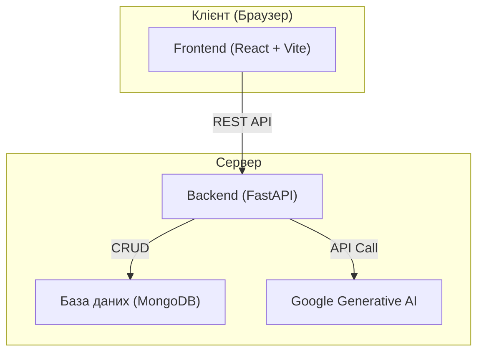

# 📊 Програмно-аналітичний комплекс для аналізу та моніторингу потреб молоді


Це дипломний проєкт, що являє собою веб-додаток для автоматизації процесу збору, аналізу та візуалізації даних соціологічних опитувань. Головна мета — надати зручний інструмент для моніторингу потреб молоді, використовуючи сучасні технології, включно з аналізом за допомогою штучного інтелекту.

## ✨ Ключові можливості

-   **📝 Гнучкий конструктор опитувань:** Створення анкет з різними типами запитань.
-   **🤖 AI-аналіз текстових відповідей:** Автоматичне узагальнення та виявлення ключових тем у відкритих питаннях за допомогою Google Generative AI.
-   **📊 Інтерактивні дашборди:** Візуалізація кількісних даних у вигляді графіків та діаграм.
-   **📄 Автоматична генерація звітів:** Можливість експорту результатів аналізу у форматі PDF.
-   **🔐 Розмежування доступу:** Система автентифікації для адміністраторів та користувачів.

## 🏛️ Архітектура

Система побудована на основі клієнт-серверної архітектури, що складається з трьох основних компонентів:



## 🛠️ Стек технологій

| Компонент | Технологія                                                                      |
| :-------- | :------------------------------------------------------------------------------ |
| **Backend** | `Python`, `FastAPI`, `Pydantic`, `Uvicorn`                                      |
| **Frontend**| `React`, `TypeScript`, `Vite`, `axios`                                          |
| **База даних**| `MongoDB` (з використанням `pymongo`)                                           |
| **Аналіз даних**| `Pandas`, `Matplotlib`, `google-genai`                                          |
| **Звіти**   | `fpdf2`                                                                         |

## 🚀 Налаштування та запуск

Найпростіший спосіб запустити проєкт — використовувати Docker. Також можливий ручний запуск для розробки.

### 📋 Попередні вимоги

-   [Git](https://git-scm.com/)
-   [Docker](https://www.docker.com/get-started) та [Docker Compose](https://docs.docker.com/compose/install/) (для Docker-запуску)
-   [Python 3.11+](https://www.python.org/downloads/) та [Node.js 20+](https://nodejs.org/en/) (для ручного запуску)

---

### 🐋 Спосіб 1: Docker (Рекомендовано)

Це запустить усі компоненти (Frontend, Backend, MongoDB) однією командою.

1.  **Клонуйте репозиторій:**
    ```bash
    git clone https://github.com/ВАШ_ЛОГІН/youthpulse.git
    cd youthpulse
    ```

2.  **Налаштуйте змінні оточення:**
    Створіть файл `.env` у **корені проєкту** та додайте ваші ключі (використовуйте `.env.example` як шаблон):
    ```bash
    cp .env.example .env
    # Відредагуйте .env, додавши GEMINI_API_KEY та MONGO_URI
    ```

3.  **Запустіть комплекс:**
    ```bash
    docker-compose up --build
    ```

**Доступ до системи:**
-   🌐 **Frontend:** [http://localhost](http://localhost)
-   🔌 **Backend API:** [http://localhost/api/](http://localhost/api/)

---

### 🛠️ Спосіб 2: Ручний запуск (для розробки)

Якщо ви хочете вносити зміни та бачити їх миттєво без перезбірки контейнерів.

#### 1. Спільне налаштування
Створіть файл `.env` у корені проєкту (як описано вище). Він буде використовуватися і бекендом, і фронтендом.

#### 2. Запуск Backend
```bash
cd backend
python -m venv venv
# Активуйте віртуальне оточення:
# Windows: .\venv\Scripts\activate
# Linux/macOS: source venv/bin/activate

pip install -r requirements.txt
uvicorn main:app --reload
```

#### 3. Запуск Frontend
```bash
cd frontend
npm install
npm run dev
```

---

## 🖼️ Галерея

*(Тут ви можете додати скріншоти вашого додатку)*

| Дашборд                               | Конструктор опитувань                 |
| :------------------------------------: | :------------------------------------: |
|  |  |

## 📄 Ліцензія

Цей проєкт розповсюджується за ліцензією MIT. Детальніше дивіться у файлі [LICENSE](LICENSE).
